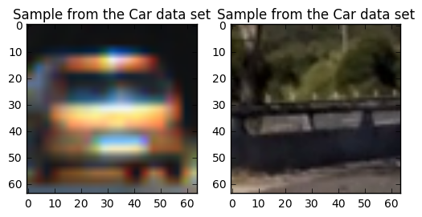

# VideoDetectionAndTracking

We start examining car and nocar pictures dataset.
 CAR image from vehicles dataset
 
 NOCAR dataset from non- vehicles dataset
 

## Histogram of Oriented Gradients (HOG)

The single_img_features or extract_features (for several images) use the function get_hog_features (lines 238-248) in the library_classifier.py file

<pre>
 #7) Compute HOG features if flag is set
    if hog_feat == True:
        if hog_channel == 'ALL':
            hog_features = []
            for channel in range(feature_image.shape[2]):
                hog_features.extend(get_hog_features(feature_image[:,:,channel], 
                                    orient, pix_per_cell, cell_per_block, 
                                    vis=False, feature_vec=True))      
        else:
            hog_features = get_hog_features(feature_image[:,:,hog_channel], orient, 
                        pix_per_cell, cell_per_block, vis=False, feature_vec=True)
</pre>

Paremeters chosen were:

    color_space = 'HSV' # Can be RGB, HSV, LUV, HLS, YUV, YCrCb
    orient = 9  # HOG orientations
    pix_per_cell = 8 # HOG pixels per cell
    cell_per_block = 2 # HOG cells per block
    hog_channel = 2 # Can be 0, 1, 2, or "ALL"

<b>USING HSV </b>
<pre>
('Using:', 9, 'orientations', 8, 'pixels per cell and', 2, 'cells per block')
('Feature vector length:', 4932)
(19.01, 'Seconds to train SVC...')
('TRAIN Accuracy of SVC = ', 1.0)
('TEST Accuracy of SVC = ', 0.9755)
('My SVC predicts: ', array([ 1.,  0.,  1.,  0.,  0.,  1.,  0.,  0.,  1.,  1.,  1.,  0.,  1.,
        0.,  1.,  0.,  1.,  0.,  1.,  0.]))
('For these', 20, 'labels: ', array([ 1.,  0.,  1.,  0.,  0.,  1.,  0.,  0.,  1.,  1.,  1.,  0.,  1.,
        0.,  1.,  0.,  1.,  0.,  1.,  0.]))
(0.01309, 'Seconds to predict', 20, 'labels with SVC')
</pre>

<b>USING YUV</b>
<pre>
('Using:', 9, 'orientations', 8, 'pixels per cell and', 2, 'cells per block')
('Feature vector length:', 4932)
(15.11, 'Seconds to train SVC...')
('TRAIN Accuracy of SVC = ', 1.0)
('TEST Accuracy of SVC = ', 0.9851)
('My SVC predicts: ', array([ 0.,  0.,  0.,  1.,  1.,  1.,  0.,  0.,  0.,  1.,  1.,  1.,  1.,
        1.,  0.,  1.,  0.,  1.,  0.,  0.]))
('For these', 20, 'labels: ', array([ 0.,  0.,  0.,  1.,  1.,  1.,  0.,  0.,  0.,  1.,  1.,  0.,  1.,
        1.,  0.,  1.,  0.,  1.,  0.,  0.]))
(0.00894, 'Seconds to predict', 20, 'labels with SVC')
</pre>
<b> Using YCrCb </b>

<li>color_space='YCrCb'</li>
<li>orient=9</li>
<li>pix_per_cell=8</li>
<li>cell_per_block=2</li>
<li>hog_channel='ALL'</li>
<li>spatial_size=(32, 32)</li>
<li>hist_bins=32</li>
<li>hist_range=(0, 256)</li>

<pre>
(89.08, 'Seconds to extract HOG features...')
('cars is length:', 8792)
('notcars is length', 8968)
('number of features', 8792)
(' number of features', 8968)
((8460,), (8460,), (8460,))

('Feature vector length:', 8460)
(26.45, 'Seconds to train SVC...')
('Test Accuracy of SVC = ', 0.9882)
('TRAIN Accuracy of SVC = ', 1.0)
('My SVC predicts: ', array([ 1.,  1.,  0.,  1.,  1.,  0.,  1.,  0.,  0.,  0.,  0.,  1.,  1.,
        0.,  1.,  1.,  0.,  0.,  0.,  1.]))
('For these', 20, 'labels: ', array([ 1.,  1.,  0.,  1.,  1.,  0.,  1.,  0.,  0.,  0.,  0.,  1.,  1.,
        0.,  1.,  1.,  0.,  0.,  0.,  1.]))
(0.03915, 'Seconds to predict', 20, 'labels with SVC')

</pre>

The test accuracy with YCrCb has the highest accuracy with respects of other parameters (YUV 98.51% ; 97.55% for HSV)

### Explanation given for methods used to extract HOG features, including which color space was chosen, which HOG parameters (orientations, pixels_per_cell, cells_per_block), and why.

### Describe how (and identify where in your code) you trained a classifier using your selected HOG features (and color features if you used them).

## Sliding Window Search

Describe how (and identify where in your code) you implemented a sliding window search. How did you decide what scales to search and how much to overlap windows?

A sliding window approach has been implemented, where overlapping tiles in each test image are classified as vehicle or non-vehicle. Some justification has been given for the particular implementation chosen.

Show some examples of test images to demonstrate how your pipeline is working. How did you optimize the performance of your classifier?

Some discussion is given around how you improved the reliability of the classifier i.e., fewer false positives and more reliable car detections (this could be things like choice of feature vector, thresholding the decision function, hard negative mining etc.)

## Video Implementation

Provide a link to your final video output. Your pipeline should perform reasonably well on the entire project video (somewhat wobbly or unstable bounding boxes are ok as long as you are identifying the vehicles most of the time with minimal false positives.)

The sliding-window search plus classifier has been used to search for and identify vehicles in the videos provided. Video output has been generated with detected vehicle positions drawn (bounding boxes, circles, cubes, etc.) on each frame of video.

Describe how (and identify where in your code) you implemented some kind of filter for false positives and some method for combining overlapping bounding boxes.

A method, such as requiring that a detection be found at or near the same position in several subsequent frames, (could be a heat map showing the location of repeat detections) is implemented as a means of rejecting false positives, and this demonstrably reduces the number of false positives. Same or similar method used to draw bounding boxes (or circles, cubes, etc.) around high-confidence detections where multiple overlapping detections occur.

## Discussion

Briefly discuss any problems / issues you faced in your implementation of this project. Where will your pipeline likely fail? What could you do to make it more robust?

Discussion includes some consideration of problems/issues faced, what could be improved about their algorithm/pipeline, and what hypothetical cases would cause their pipeline to fail.

Jupyter NotebookVideo Detection and Tracking Last Checkpoint: 2 minutes ago (unsaved changes) 
Python [conda env:root2] 
File
Edit
View
Insert
Cell
Kernel
Widgets
Help
CellToolbar
The PIPELINE is in three parts:
Train a classifier to recognize vehicles
a) Cell STEP 1 check the samples for cars and not cars, display one image from each set b) cell STEP 2 we extract the color and the HOG features In this step we use the Histogram of Oriented Gradients for feature extraction and normalized
    # Read in each one by one
    # apply color conversion if other than 'RGB'
    # Apply bin_spatial() to get spatial color features
    # Apply color_hist() to get color histogram features
    # Append the new feature vector to the features list
    # Return list of feature vectors

#Parameters to extract the features
colorspace = 'RGB' # Can be RGB, HSV, LUV, HLS, YUV, YCrCb
orient = 9
pix_per_cell = 8
cell_per_block = 2
hog_channel = 0
c) Cell STEP 3 Normalize the samples Divide the smplesinto test and training sets Apply the classifier SVM Try out the recognition on a single image Save the model and the scaler (generate 2 files)
Roll the classification on a sliding-window
Recognize vehicles on a video
Reject false positives and apply on a video stream
Reject false positives using heat maps Overlay lane detection from previous project4
In [1]:

import numpy as np
import matplotlib.pyplot as plt
import matplotlib.image as mpimg
import glob
import cv2
import pickle
from random import randint
​
import time
from sklearn.svm import LinearSVC
from sklearn.calibration import CalibratedClassifierCV
from sklearn.preprocessing import StandardScaler
from skimage.feature import hog
from sklearn.model_selection import train_test_split
import scipy as sc
from library_classifier import *
​
​
​
In [2]:

# __ STEP 1  __ Extracting the path of the two data sets: vehicles and non-vechicles
path_images_cars = glob.glob('vehicles/*/*.png')
cars = []
notcars = []
for image in path_images_cars:
    cars.append(image)
​
path_images_notcars = glob.glob('non-vehicles/*/*.png')
for image in path_images_notcars:
    notcars.append(image)
​
# Rendering one image from each set for testing    
cars_sample=randint(0,len(cars))
notcars_sample=randint(0, len(notcars))
print ("vector cars is:", len(cars))
print ("non cars is:", len(notcars))
print ("random cars_sample cars is:", cars_sample)
print ("random nonnotcars_samplecars is:", notcars_sample)
​
​
​
# Define a function to return some characteristics of the dataset 
def data_look(car_list, notcar_list):
    data_dict = {}
    # Define a key in data_dict "n_cars" and store the number of car images
    data_dict["n_cars"] = len(car_list)
    # Define a key "n_notcars" and store the number of notcar images
    data_dict["n_notcars"] = len(notcar_list)
    # Read in a test image, either car or notcar
    example_img = mpimg.imread(car_list[0])
    # Define a key "image_shape" and store the test image shape 3-tuple
    data_dict["image_shape"] = example_img.shape
    # Define a key "data_type" and store the data type of the test image.
    data_dict["data_type"] = example_img.dtype
    # Return data_dict
    return data_dict
    
data_info = data_look(cars, notcars)
​
print('Your function returned a count of', 
      data_info["n_cars"], ' cars and', 
      data_info["n_notcars"], ' non-cars')
print('of size: ',data_info["image_shape"], ' and data type:', 
      data_info["data_type"])
​
# Plot the examples
fig = plt.figure()
plt.subplot(121)
img = plt.imread(cars[cars_sample])
plt.imshow(img)
plt.title('Sample from the Car data set')
plt.subplot(122)
img = plt.imread(notcars[notcars_sample])
plt.imshow(img)
plt.title('Sample from the Car data set')
plt.show()
      
​
    
('vector cars is:', 8792)
('non cars is:', 8968)
('random cars_sample cars is:', 5842)
('random nonnotcars_samplecars is:', 5154)
('Your function returned a count of', 8792, ' cars and', 8968, ' non-cars')
('of size: ', (64, 64, 3), ' and data type:', dtype('float32'))

In [3]:

# Extractingthe features HOG
# Cell __ STEP 2  __
​
​
#Parameters for the features extraction 
​
color_space = 'HSV' # Can be RGB, HSV, LUV, HLS, YUV, YCrCb
orient = 9  # HOG orientations
pix_per_cell = 8 # HOG pixels per cell
cell_per_block = 2 # HOG cells per block
hog_channel = 0 # Can be 0, 1, 2, or "ALL"
spatial_size = (32, 32) # Spatial binning dimensions
hist_bins = 32    # Number of histogram bins
spatial_feat = True # Spatial features on or off
hist_feat = True # Histogram features on or off
hog_feat = True # HOG features on or off
y_start_stop = [400, 680] # Min and max in y to search in slide_window()
​
​
​
# Generate a random index to look at a car image
ind = np.random.randint(0, len(cars))
# Read in the image
image = mpimg.imread(cars[20])
gray = cv2.cvtColor(image, cv2.COLOR_RGB2GRAY)
​
# Call our function with vis=True to see an image output
features, hog_image = get_hog_features(gray, orient, 
                        pix_per_cell, cell_per_block, 
                        vis=True, feature_vec=False)
​
# Plot the examples
fig = plt.figure()
plt.subplot(121)
plt.imshow(gray, cmap='gray')
plt.title('Example Car Image')
plt.subplot(122)
plt.imshow(hog_image, cmap='gray')
plt.title('HOG Visualization')
plt.show()

In [4]:

# Extracting Colro features
​
t=time.time() # counting time start
car_features = extract_features(cars, color_space=color_space, orient=orient, 
                        pix_per_cell=pix_per_cell, cell_per_block=cell_per_block, 
                        hog_channel=hog_channel)
notcar_features = extract_features(notcars, color_space=color_space, orient=orient, 
                        pix_per_cell=pix_per_cell, cell_per_block=cell_per_block, 
                        hog_channel=hog_channel)
t2 = time.time() # counting time stop
print(round(t2-t, 2), 'Seconds to extract HOG features...')
​
​
print ("cars is length:",len(cars))
print ("notcars is length",len(notcars))
print ("number of features", len(car_features))
print (" number of features",len(notcar_features))
​
if len(car_features) > 0:
    # Create an array stack of feature vectors
    X = np.vstack((car_features, notcar_features)).astype(np.float64)                        
    # Fit a per-column scaler
    X_scaler = StandardScaler().fit(X)
    # Apply the scaler to X
    scaled_X = X_scaler.transform(X)
    car_ind = np.random.randint(0, len(cars))
    # Plot an example of raw and scaled features
    fig = plt.figure(figsize=(12,4))
    plt.subplot(131)
    plt.imshow(mpimg.imread(cars[car_ind]))
    
    plt.title('Original Image')
    plt.subplot(132)
   
    plt.plot(X[car_ind])
    plt.title('Raw Features')
    
    plt.subplot(133)
    plt.plot(scaled_X[car_ind])
   
    plt.title('Normalized Features')
    #plt.show()
    fig.tight_layout()
    plt.show()
else: 
    print('Your function only returns empty feature vectors...')
​
print(notcar_features[2].shape, notcar_features[0].shape, notcar_features[1].shape)
(45.71, 'Seconds to extract HOG features...')
('cars is length:', 8792)
('notcars is length', 8968)
('number of features', 8792)
(' number of features', 8968)

((4932,), (4932,), (4932,))
In [5]:

# Cell __ STEP 3 __
# Training a SVC estimator 
​
# Define the labels vector
y = np.hstack((np.ones(len(car_features)), np.zeros(len(notcar_features))))
​
​
# Split up data into randomized training and test sets
rand_state = np.random.randint(0, 100)
X_train, X_test, y_train, y_test = train_test_split(
    scaled_X, y, test_size=0.2, random_state=rand_state)
​
print('Using:',orient,'orientations',pix_per_cell,
    'pixels per cell and', cell_per_block,'cells per block')
print('Feature vector length:', len(X_train[0]))
​
# Use a linear SVC 
svc = LinearSVC()
​
# Check the training time for the SVC
t=time.time()
svc.fit(X_train, y_train)
t2 = time.time()
print(round(t2-t, 2), 'Seconds to train SVC...')
# Check the score of the SVC
print('TRAIN Accuracy of SVC = ', round(svc.score(X_train, y_train), 4))
print('TEST Accuracy of SVC = ', round(svc.score(X_test, y_test), 4))
​
# Check the prediction time for a single sample
t=time.time()
n_predict = 20
print('My SVC predicts: ', svc.predict(X_test[0:n_predict]))
print('For these',n_predict, 'labels: ', y_test[0:n_predict])
t2 = time.time()
print(round(t2-t, 5), 'Seconds to predict', n_predict,'labels with SVC')
​
# save the model to disk
filename = 'model_color_hog.sav'
pickle.dump(svc, open(filename, 'wb'))
filename = 'save_scaler.sav'
pickle.dump(X_scaler, open(filename, 'wb'))
​
​
('Using:', 9, 'orientations', 8, 'pixels per cell and', 2, 'cells per block')
('Feature vector length:', 4932)
(18.59, 'Seconds to train SVC...')
('TRAIN Accuracy of SVC = ', 1.0)
('TEST Accuracy of SVC = ', 0.9741)
('My SVC predicts: ', array([ 1.,  0.,  1.,  0.,  1.,  0.,  1.,  1.,  0.,  1.,  0.,  1.,  0.,
        1.,  1.,  1.,  1.,  1.,  0.,  0.]))
('For these', 20, 'labels: ', array([ 1.,  0.,  1.,  0.,  1.,  0.,  1.,  1.,  0.,  1.,  0.,  1.,  0.,
        1.,  1.,  1.,  1.,  1.,  0.,  0.]))
(0.003, 'Seconds to predict', 20, 'labels with SVC')
In [6]:

# Cell __STEP 4__ creating windows where to recognize patters and display them on a single image
# possible_windows is the list of overlapping windows where classifier will work on
# example is dispayed on result_image
​
from library_classifier import *
​
image_test1 = mpimg.imread('test1.jpg')
image_test5 = mpimg.imread('test5.jpg')
test_images = []
test_images.append(np.copy(image_test1))
test_images.append(np.copy(image_test5))
​
#defining regions of interest and size of boxes to look for recognitions
scales = [(40,40), (60,60), (90,90), (120,120), (170,170)]
overlaps = [0.5, 0.5, 0.5, 0.5, 0.5]
y_stops = [500, 550, 600, 650, None]
x_start_stops = [[400,850], [360,890], [320,930], [None, None], [None, None]]
colors = [(0,255,0), (255,0,0), (128,128,0), (0,128,128), (128,0,128)]
​
result_image = []
for image in test_images:
    possible_windows = np.copy(image)
    for scale, overlap, color, y_stop, x_start_stop in zip(scales, overlaps, colors, y_stops, x_start_stops):
​
        windows = slide_window(possible_windows, x_start_stop=x_start_stop, y_start_stop=[380,y_stop],
                                   xy_window=scale, xy_overlap=(overlap, overlap))
​
        possible_windows = draw_boxes(possible_windows, windows, color=color, thick=6) 
​
    result_image.append((np.copy(possible_windows)))
​
# Plot the test images
for i in range(len(result_image)):
    imgplot = plt.imshow(result_image[i])
    plt.show()
      
​

In [7]:

# In this STEP we use the classifier that we previously training and the list of windows we defined
# we apply the classifier on a single image
​
​
from library_classifier import *
​
# load SVM model
svc = pickle.load(open('model_color_hog.sav', 'rb'))
​
# load scaler
X_scaler = pickle.load(open('save_scaler.sav', 'rb'))
​
################### SETTINGS CLASSIFIER ##############################
color_space = 'HSV' # Can be RGB, HSV, LUV, HLS, YUV, YCrCb
orient = 9  # HOG orientations
pix_per_cell = 8 # HOG pixels per cell
cell_per_block = 2 # HOG cells per block
hog_channel = 2 # Can be 0, 1, 2, or "ALL"
spatial_size = (32, 32) # Spatial binning dimensions
hist_bins = 32    # Number of histogram bins
spatial_feat = True # Spatial features on or off
hist_feat = True # Histogram features on or off
hog_feat = True # HOG features on or off
y_start_stop = [400, 680] # Min and max in y to search in slide_window()
​
image = mpimg.imread('bbox-example-image.jpg')
draw_image = np.copy(image)
​
windows = slide_window(image, x_start_stop=[None, None], y_start_stop=y_start_stop, 
                    xy_window=(64, 64), xy_overlap=(0.50, 0.50))
​
hot_windows = search_windows(image, windows, svc, X_scaler, color_space=color_space, 
                        spatial_size=spatial_size, hist_bins=hist_bins, 
                        orient=orient, pix_per_cell=pix_per_cell, 
                        cell_per_block=cell_per_block, 
                        hog_channel=hog_channel, spatial_feat=spatial_feat, 
                        hist_feat=hist_feat, hog_feat=hog_feat)                       
​
window_img = draw_boxes(draw_image, hot_windows, color=(118, 75, 56), thick=6)                    
​
plt.imshow(window_img)
plt.show()
​

In [11]:

def pipeline(file, output_dir, save_inter, svc, scaler, filepath, debugging_tracking):
​
    from scipy.ndimage.measurements import label
    import os
​
    if filepath == True:
        print("processing : {}".format(file))
        img = cv2.imread(file)
        image_name = os.path.split(file)[-1]
    else :
        img = file
        image_name = 'video'
​
    #printing the whole array for debugging purposes
    np.set_printoptions(threshold=np.inf)    
    
    # ################## SETTINGS PIPELINE ################################
    scales = [(64, 64), (96, 96), (128, 128)]
    overlaps = [0.50, 0.50, 0.50]
    y_start_stops = [[400, 500], [400, 500], [400, 600]]
    x_start_stops = [[None, None], [None, None], [None, None]]
    colors = [(255, 0, 0), (128, 128, 0), (0, 128, 128)]
    # #####################################################################
​
    # ################## SETTINGS CLASSIFIER ##############################
    color_space = 'HSV' # Can be RGB, HSV, LUV, HLS, YUV, YCrCb
    orient = 9  # HOG orientations
    pix_per_cell = 8 # HOG pixels per cell
    cell_per_block = 2 # HOG cells per block
    hog_channel = 2 # Can be 0, 1, 2, or "ALL"
    spatial_size = (32, 32) # Spatial binning dimensions
    hist_bins = 32    # Number of histogram bins
    spatial_feat = True # Spatial features on or off
    hist_feat = True # Histogram features on or off
    hog_feat = True # HOG features on or off
    y_start_stop = [400, 680] # Min and max in y to search in slide_window()
​
    # #####################################################################
​
    heat = np.zeros_like(img[:, :, 0]).astype(np.uint8)
    
    windowed_image = np.copy(img)
    hot_windowed_image = np.copy(img)
    
​
    # STEP 1 : compute the sliding windows
    for scale, overlap, color, y_start_stop, x_start_stop in zip(scales, overlaps, colors, y_start_stops, x_start_stops):
        
        windows = slide_window(img, x_start_stop=x_start_stop, y_start_stop=y_start_stop,
                               xy_window=scale, xy_overlap=(overlap, overlap))
​
        # STEP 2 : Apply classifier on current windows
        
        hot_windows = search_windows(img, windows, svc, scaler=X_scaler, color_space=color_space,
                                     spatial_size=spatial_size, hist_bins=hist_bins,
                                     orient=orient, pix_per_cell=pix_per_cell,
                                     cell_per_block=cell_per_block,
                                     hog_channel=hog_channel, spatial_feat=spatial_feat,
                                     hist_feat=hist_feat, hog_feat=hog_feat)
        
        # debugging checking windows of interest are detected
        # print ("hot windows ",hot_windows)
​
        # STEP 3 : Compute/Update HeatMap
        heat = add_heat(heat, hot_windows)
        
        # Debugging showing that +1 is added for region of interest
        print ("0_ heat vector",heat )
            
        # adding heatmap over frames
        if ( tracking.frame_cpt==1):
            tracking.heatmap_prev=np.copy(heat)
        
       
        
        tracking.heatmap_prev = np.dstack((heat, tracking.heatmap_prev))
        print ("1_ lenght of heat_prev vector",tracking.heatmap_prev )
​
        tracking.heatmap_average = np.mean(tracking.heatmap_prev, axis = 2).astype(np.uint8)
        heat = np.copy(tracking.heatmap_average)
        print ("2 _lenght of heat_prev vector",tracking.heatmap_prev )
        
        print ("frame counter is", tracking.frame_cpt)
        tracking.frame_cpt += 1
            
        if (tracking.frame_cpt == tracking.rolling_average):
            tracking.frame_cpt=0
            tracking.heatmap_average = None
            heatmap_prev = None
            print ("averaging heatmap at", tracking.frame_cpt)
           
​
    
    # STEP 4 : Apply Threshold on HeatMap and map values to [0, 255]
        heat = apply_threshold(heat, 2)
        heatmap = np.clip(heat, 0, 255)
        
        
    
    # STEP 5 : Determine bounding boxes and draw on images
    labels = label(heatmap)
    draw_img = draw_labeled_bboxes(np.copy(img), labels)
​
    if (debugging_tracking==True):
            
            #displayng original image
            #displaying heatmap
           
            imgplot = plt.imshow(img)
            plt.show()
            #displaying heatmap
            imgplot = plt.imshow(heatmap, cmap='hot')
            plt.show()
    
    return draw_img
In [9]:

# Trying the pipeline on 1 image
from library_classifier import *
​
debugging_tracking = True
tracking = tracking_car()
​
image_path = 'bbox-example-image.jpg'
pipeline(image_path, None, False, svc, X_scaler, True, debugging_tracking)
processing : bbox-example-image.jpg
('lenght of heat prev vector', 720)
('frame counter is', 1)
('lenght of heat prev vector', 720)
('frame counter is', 2)
('lenght of heat prev vector', 720)
('frame counter is', 3)

Out[9]:
array([[[218, 151,  96],
        [218, 151,  96],
        [218, 151,  96],
        ..., 
        [217, 147,  94],
        [217, 147,  94],
        [218, 148,  95]],

       [[219, 152,  97],
        [219, 152,  97],
        [219, 152,  97],
        ..., 
        [217, 147,  94],
        [218, 148,  95],
        [218, 148,  95]],

       [[219, 152,  97],
        [220, 153,  98],
        [220, 153,  98],
        ..., 
        [217, 147,  94],
        [218, 148,  95],
        [218, 148,  95]],

       ..., 
       [[137, 149, 143],
        [117, 129, 123],
        [107, 119, 113],
        ..., 
        [144, 161, 152],
        [152, 168, 161],
        [155, 171, 164]],

       [[130, 140, 134],
        [134, 144, 138],
        [146, 156, 150],
        ..., 
        [150, 167, 158],
        [152, 168, 161],
        [149, 165, 158]],

       [[127, 137, 131],
        [134, 144, 138],
        [156, 166, 160],
        ..., 
        [149, 165, 158],
        [154, 170, 163],
        [151, 167, 160]]], dtype=uint8)
In [12]:

from moviepy.editor import VideoFileClip
​
start = time.time()
​
#load the models
svc = pickle.load(open('model_color_hog.sav', 'rb'))
# load scaler
X_scaler = pickle.load(open('save_scaler.sav', 'rb'))
​
tracking = tracking_car()
​
file="project_video.mp4"
​
def create_image_pipeline(svc, scaler):
        def image_pipeline(file):
            return pipeline(file, None, False, svc, scaler, filepath=False, debugging_tracking=False)
        return image_pipeline
​
image_pipeline = create_image_pipeline(svc, X_scaler)
​
# load input_video
clip1 = VideoFileClip("project_video.mp4")
​
# apply the pipeline to the video
output_clip = clip1.fl_image(image_pipeline)
​