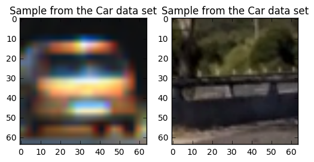
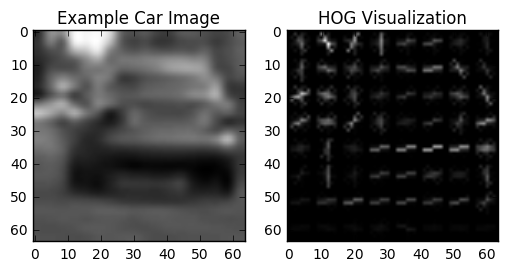
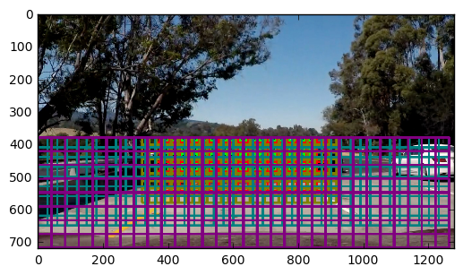
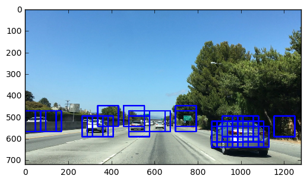
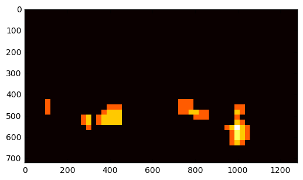

# VideoDetectionAndTracking

We start examining car and nocar pictures dataset.

#### Car dataset / NoCar dataset
 

## Histogram of Oriented Gradients (HOG)

The single_img_features or extract_features (for several images) use the function get_hog_features (lines 238-248) in the library_classifier.py file

<pre>
 #7) Compute HOG features if flag is set
    if hog_feat == True:
        if hog_channel == 'ALL':
            hog_features = []
            for channel in range(feature_image.shape[2]):
                hog_features.extend(get_hog_features(feature_image[:,:,channel], 
                                    orient, pix_per_cell, cell_per_block, 
                                    vis=False, feature_vec=True))      
        else:
            hog_features = get_hog_features(feature_image[:,:,hog_channel], orient, 
                        pix_per_cell, cell_per_block, vis=False, feature_vec=True)
</pre>

Paremeters chosen were:

    color_space = 'HSV' # Can be RGB, HSV, LUV, HLS, YUV, YCrCb
    orient = 9  # HOG orientations
    pix_per_cell = 8 # HOG pixels per cell
    cell_per_block = 2 # HOG cells per block
    hog_channel = 2 # Can be 0, 1, 2, or "ALL"

<b>USING HSV </b>
<pre>
('Using:', 9, 'orientations', 8, 'pixels per cell and', 2, 'cells per block')
('Feature vector length:', 4932)
(19.01, 'Seconds to train SVC...')
('TRAIN Accuracy of SVC = ', 1.0)
('TEST Accuracy of SVC = ', 0.9755)
('My SVC predicts: ', array([ 1.,  0.,  1.,  0.,  0.,  1.,  0.,  0.,  1.,  1.,  1.,  0.,  1.,
        0.,  1.,  0.,  1.,  0.,  1.,  0.]))
('For these', 20, 'labels: ', array([ 1.,  0.,  1.,  0.,  0.,  1.,  0.,  0.,  1.,  1.,  1.,  0.,  1.,
        0.,  1.,  0.,  1.,  0.,  1.,  0.]))
(0.01309, 'Seconds to predict', 20, 'labels with SVC')
</pre>

<b>USING YUV</b>
<pre>
('Using:', 9, 'orientations', 8, 'pixels per cell and', 2, 'cells per block')
('Feature vector length:', 4932)
(15.11, 'Seconds to train SVC...')
('TRAIN Accuracy of SVC = ', 1.0)
('TEST Accuracy of SVC = ', 0.9851)
('My SVC predicts: ', array([ 0.,  0.,  0.,  1.,  1.,  1.,  0.,  0.,  0.,  1.,  1.,  1.,  1.,
        1.,  0.,  1.,  0.,  1.,  0.,  0.]))
('For these', 20, 'labels: ', array([ 0.,  0.,  0.,  1.,  1.,  1.,  0.,  0.,  0.,  1.,  1.,  0.,  1.,
        1.,  0.,  1.,  0.,  1.,  0.,  0.]))
(0.00894, 'Seconds to predict', 20, 'labels with SVC')
</pre>

<b> Using YCrCb </b>

<li>color_space='YCrCb'</li>
<li>orient=9</li>
<li>pix_per_cell=8</li>
<li>cell_per_block=2</li>
<li>hog_channel='ALL'</li>
<li>spatial_size=(32, 32)</li>
<li>hist_bins=32</li>
<li>hist_range=(0, 256)</li>

<pre>
(89.08, 'Seconds to extract HOG features...')
('cars is length:', 8792)
('notcars is length', 8968)
('number of features', 8792)
(' number of features', 8968)
((8460,), (8460,), (8460,))

('Feature vector length:', 8460)
(26.45, 'Seconds to train SVC...')
('Test Accuracy of SVC = ', 0.9882)
('TRAIN Accuracy of SVC = ', 1.0)
('My SVC predicts: ', array([ 1.,  1.,  0.,  1.,  1.,  0.,  1.,  0.,  0.,  0.,  0.,  1.,  1.,
        0.,  1.,  1.,  0.,  0.,  0.,  1.]))
('For these', 20, 'labels: ', array([ 1.,  1.,  0.,  1.,  1.,  0.,  1.,  0.,  0.,  0.,  0.,  1.,  1.,
        0.,  1.,  1.,  0.,  0.,  0.,  1.]))
(0.03915, 'Seconds to predict', 20, 'labels with SVC')

</pre>

The test accuracy with YCrCb has the highest accuracy with respects of other parameters (YUV 98.51% ; 97.55% for HSV)

### Explanation given for methods used to extract HOG features, including which color space was chosen, which HOG parameters (orientations, pixels_per_cell, cells_per_block), and why.
If the number of pixels per cell is 2 we get a HOG very precise but computation time is greater. 8 provides a good compromise

#### with 2 pixels per cell
 

#### with 8 pixels per cell
 

#### Orient

Chosing the value allows to detect the gradients over 360 degrees

#### color space YCrCb 
Gave the best compromise extraction time/accuracy

### Describe how (and identify where in your code) you trained a classifier using your selected HOG features (and color features if you used them).

Steps:
1)First step is to stack the features of Cars and NoTCars 
<pre>
X = np.vstack((car_features, notcar_features)).astype(np.float64)
</pre>

2)Define a Standard Scaler and normalize 

<pre>

# Fit a per-column scaler
X_scaler = StandardScaler().fit(X)

# Apply the scaler to X
scaled_X = X_scaler.transform(X)
</pre>

3) Training is defined using a training set and a test set with teh function <b>train_test_split</b> with a ratio of 20% for the test set.

<pre>
X_train, X_test, y_train, y_test = train_test_split(scaled_X, y, test_size=0.2, random_state=rand_state)
</pre>

4) Train the classifier SVC (Support Vector Classification).

<pre>

# Create an array stack of feature vectors
X = np.vstack((car_features, notcar_features)).astype(np.float64)

# Fit a per-column scaler
X_scaler = StandardScaler().fit(X)

# Apply the scaler to X
scaled_X = X_scaler.transform(X)

# Split up data into randomized training and test sets
rand_state = np.random.randint(0, 100)
X_train, X_test, y_train, y_test = train_test_split(scaled_X, y, test_size=0.2, random_state=rand_state)

print('Feature vector length:', len(X_train[0]))
# Use a linear SVC
svc = LinearSVC()
# Check the training time for the SVC
t = time.time()
svc.fit(X_train, y_train)
</pre>

## Sliding Window Search

The classifier has been applied on windows that overlapp, a canevas where to search for cars. The windows are of different sizes to detect cars of different size as they get closer to the horizon.

Once  I got many more false positive, see result_video_SingleFrameSolution.mp4.

The image frame has overlapping windows where the model is applied to.

<pre>
windows = slide_window(img, x_start_stop=x_start_stop, y_start_stop=y_start_stop,
                               xy_window=scale, xy_overlap=(overlap, overlap))

        # STEP 2 : Apply classifier on current windows
        """
        hot_windows = search_windows(img, windows, svc, scaler=X_scaler, color_space=color_space,
                                     spatial_size=spatial_size, hist_bins=hist_bins,
                                     orient=orient, pix_per_cell=pix_per_cell,
                                     cell_per_block=cell_per_block,
                                     hog_channel=hog_channel, spatial_feat=spatial_feat,
                                     hist_feat=hist_feat, hog_feat=hog_feat)
        """
        draw_img, bbox_list = find_cars(img, ystart=400, ystop=680 , scale=1.5, svc=svc, X_scaler=X_scaler, orient=orient,
                                   pix_per_cell=pix_per_cell, cell_per_block=cell_per_block,
                                   spatial_size=spatial_size, hist_bins=hist_bins)
                                   
</pre>

Threshold of 100% accuracy was first chosen and in find_cars and no false positive are found (lines 348-352 in library_classifier.py):

<pre>
    test_prediction = svc.predict(test_features)
            

            if test_prediction == 1:
            I did not get many false positive using the find_cars.
</pre>

To give a higher chance of finding cars I decreased to 60% and started finding some false positive

<pre>
            test_prediction = svc.predict(test_features)
            
            prediction = int(test_prediction>0.6)

            if test_prediction == 1:
</pre>

#### Heat functions

The multiple detection are simplified using the add_heat:

In the library_classifier.py lines 251-256
<pre>
def add_heat(heatmap, bbox_list):
    # Iterate through list of bboxes
    for box in bbox_list:
        # Add += 1 for all pixels inside each bbox
        # Assuming each "box" takes the form ((x1, y1), (x2, y2))
        heatmap[box[0][1]:box[1][1], box[0][0]:box[1][0]] += 1

    # Return updated heatmap
    return heatmap# Iterate through list of bboxes

</pre>

And in the pipeline we simplified the windows if more than windows superimpose:

<pre>
    STEP 4 : Apply Threshold on HeatMap and map values to [0, 255]
        heat = apply_threshold(heat, 2)
        heatmap = np.clip(heat, 0, 255)
</pre>        

The pixels part of the window that is detected is represented by a heatmap:

## Video Implementation

Videos output:

<li> result_video.mp4 </li>using the find_cars function. Long computation time: 20218 seconds, high accuracy.
<li> result_video_SingleFrameSolution.mp4 </li> a few false positive but faster to calculate

## Discussion

A good improvement would be to have the same data set with different resolutions at same time.

I see that my algorithm stop detecting the cars when they go away from the forefront of the picture.

Also, the cars on the left of the image across the barrier seem to be better detected with the single frame, but completly ignored with the function find_cars, see video result_video_YCrCn_32.mp4

